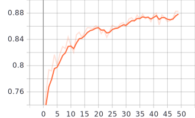

# Neural Network Ensemble

This project is to demonstrate training and evaluation of ensembling of neural network base learners using soft voting aggregation. Everything is compiled in the [main.ipynb](main.ipynb)


# Network architecture:
The network configurations are provided in [model_configs.yaml](model_configs.yaml) and configurable with different no of layers, number of hidden units and learning rate.
I have used 5 Fully connected NN with simpler to more complex architecture and different learning rate. Training is done using stratified 5-fold cross validation. Each base learner is trained on 4 different subsets and validated on hold out subset.

# Dataset
Tabular data is used for this project. Data is kept inside [data] as csv files. Ths is multi class classification task with 10 different classes.
- train data : 24000 rows and 393 colums
- valid data : 6000 rows and 393 colums
- test data : 10000 rows and 393 columns


# evaluation results
Below are training accuracy metric plots for 5 base learners:
<p float="left">
  
   
  
  
  
</p>
Below are validation accuracy metric plots for 5 base learners:
<p float="left">
  
   
  
  
  
</p>

# Test results on unseen data
- model0 accuracy: 0.7526
- model1 accuracy: 0.7303
- model2 accuracy: 0.7807
- model3 accuracy: 0.7837
- model4 accuracy: 0.778
- final ensemble accuracy:  0.7964
- confusion matrix:
```
 [[ 918    0    5    5    1    5    7    0   12   10]
 [   0 1097   16    4   12    1    0    5    4    1]
 [  19    3  766   14   84    4    5   56   41    3]
 [  10    3   38  778   11   39   29   11   80    9]
 [   5    8   83    1  744   36   12   58   11   25]
 [  15    4    2   33   32  726   45   16   12   10]
 [   7    3    4   41   16   28  741   42    9  109]
 [   8   10   87   11   80    5   64  715    6   32]
 [   5    5   46   48   47   20   22    7  779    6]
 [  25    1   11   13   45   24  150   31   13  700]]
```
# Future Scope
I have tried simple ensembling technique for the demonstration. We can use more advanced ensembling, sampling, subset feature selection, stacking based models as well.


